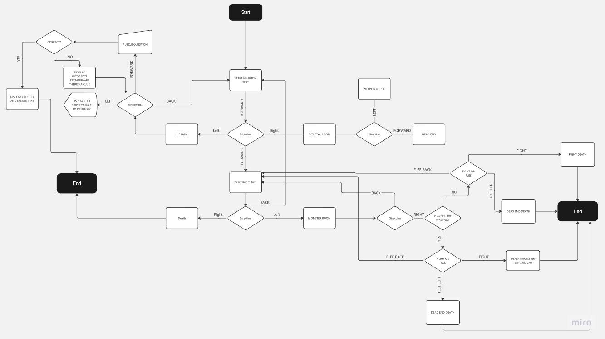

# Basic RPG Adventure!
***
## Repo Link
***

[Github Link](https://github.com/rulerrobin/T1A3)
## Summary of Features and coding styles
***

**The Basic RPG adventure** is a command line application that was planned and developed in about 1 week for the Coder Academy Term 1 Assessment 3 in the Accelarated 2023 March Cohort. This application was used to test our skills in project management and development within a short time period. The coding style guide that was being followed is the [pep8](https://peps.python.org/pep-0000/) guide which I have attempted to adhere to as well as fix code later on to follow it. 

### **Features and Deevelopment Plan**

The features of the RPG adventure game are as follows:

**Priorities**

The priority features of the game to make it an MVP was as follows:

**1. User Input**

The user will be able to input their name into the game at the start and it will be used as part of the intro question if they wish to play the game. 

Through user input once the game is accepted the user will be able to move around the rooms using selected parameters given to the player, these parameters are validated to make sure that they are valid using a while loop to check if they have made a valid choice as of yet and if so to call another function to activate the next room. 

The timeline for this was May 8-11 as I wanted to finish these so that I could add the rest of the functionality for the extra features of weapon checking and the puzzle to the rooms required.

The checklist for this feature is as follows:
1. Text indicating user input
2. Allow for user input
3. Compare user input with options available and choose to which option is relevate
4. Validate the input and provide error if invalid
5. Use a while loop to allow user to input again if invalid input
6. Create fight room without weapon
7. Quiz room & library room without random and csv yet

**2. Weapon Check**

Allow user to pick up a weapon and in a room and if the player tries to pick it up again the weapon is no longer available printing out new text that instead says the weapon is no longer where it was. The player will now have set the weapon to `True` which is then referenced by the code in a specific room of the game. This room checks if player has the weapon or not and depending on their choice to fight or flee they will either escape or die.

The timeline for this was May 9-12 as I was planning to finish this as I made the rooms along the way.

The checklist for this feature is as follows:
1. Create weapon instance that was changeable
2. Allow player to locate the weapon
3. Allow player to pick up weaon which changes weapon to True
4. If player picks weapon up text and interaction changes with area of weapon
5. Allow the weapon instance to be referenced and checked in monsterRoom which allows player to escape

Extras:
1. HP and Battle
2. Random number Dice for HP and DMG

**3. Random Number**

The game has a puzzle that generates a random number each time it is run and printed out to a CSV file. This file containing the number can be read by the player once they interact with the specific area required. This number can then be used to escape the dungeon by inputting it into another area of the maze and let the player through. The player only has 3 guesses otherwise they will die. However if the player decides to leave the guessing game, the number of guesses will reset back to 0.

Similar to the Weapon Room timeline for this was May 9-12 as I was planning to finish this as I made the rooms along the way.

The checklist for this feature is as follows:
1. Create a random number
2. Print random number to CSV file
3. Let player interact with file and read the contents
4. Code reads CSV file and uses it as a password to exit
5. Let player use the password to exit

Would be nice:
1. Attempts count and if reached = death
2. Attempts to reset if player leaves the puzzle at any point.

**4. Validation**

With each of these features validation code is used in each area to ensure that the user is only inputting valid information, this information could be moving around the map or choosing different options, it can also be for inputting the password for the puzzle into the input to ensure that it is 8 digits and only contains numbers.

### Flowchart Planning

During the planning phase of the application I used flowchart visualization to figure out how I wanted the code to interact and move between each feature. I did this so I could see what the map looked like and how the code could look in flowchart form.

**Map of the Game**

The map of the game shows the different rooms, albeit some are differently named at this stage. As per the image the green areas are the minimum that I need to complete as a functional code. The yellow areas are what I wished to achieve at that point.

**Main Flow**

Originally I wanted the player to retry if they died which is what version one would have done however for some reason I couldn't remember or figure out how to bring player back to menu so I decided to use the `quit()` function to instant quit the game which I think is more dramatic as I eventually added the ASCII art saying player had died. 

Version 1

Version 2

**Game Flow**

The flowchart below is the game itself and how each choice should have gone if I was able to complete it in time. Some things may have changed however the functionality is still the same. For example the player originally had more options in the flowchart for fighting or fleeing however I did not have time to complete what I wanted to do. The flowchart however did help me understand what I wanted to do and how I could go about doing these things.

## Project Tracker
***
I used Notion for my project tracker, the reason for this is because I use Notion to track all of the other projects I am working on and I have gotten used to using it. However it does have less functionality for a kanban board as it only has To-do, In progress and Done functionality for the board. However it does have more options when changed to different formats such as table format.

[Notion Board](https://www.notion.so/04cbbf4830ca45d7a465c5e1428629fa?v=1d9767f49a244dc59d32a73a2047e533&pvs=4)

The development plan that I made was heavily focused on planning. I used a kanban style board to build a project management system that allowed to me complete tasks day to day as well as move them/change them if needed.

Images of the project management system

**Starting Point**

**Made Majority of Code except pytest**

**What it looks like in Table format**

